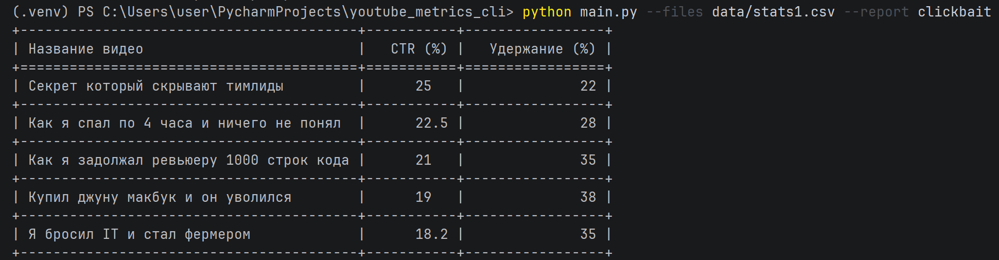
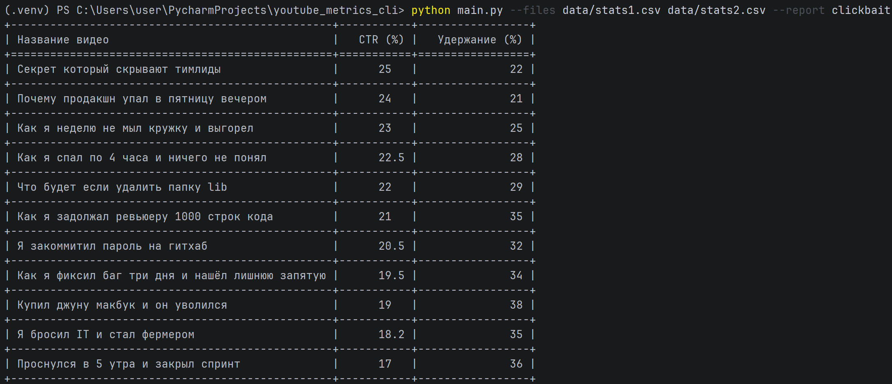
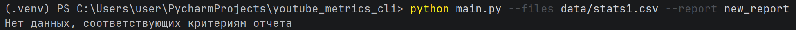
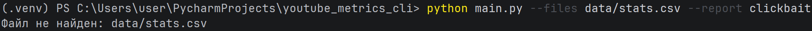

# YouTube Metrics CLI

CLI приложение для обработки CSV-файлов с метриками видео на YouTube. Приложение анализирует данные о видео и формирует отчеты, в частности, определяет кликбейтные видео на основе показателей CTR и удержания аудитории.

## 📋 Содержание

- [Возможности](#-возможности)
- [Требования](#-требования)
- [Установка](#-установка)
  - [Windows](#windows)
  - [macOS](#macos)
  - [Linux](#linux)
- [Использование](#-использование)
  - [Базовые команды](#базовые-команды)

## 🚀 Возможности

- Чтение CSV файлов с метриками YouTube видео
- Фильтрация кликбейтных видео (CTR > 15% и удержание < 40%)
- Сортировка результатов по убыванию CTR
- Вывод отчетов в виде форматированных таблиц
- Расширяемая архитектура для добавления новых типов отчетов
- Обработка ошибок с детализацией (verbose режим)
- Поддержка нескольких файлов одновременно

## 📦 Требования

- Python 3.7 или выше
- pip (менеджер пакетов Python)

## 🔧 Установка

### Windows

1. **Клонирование репозитория:**
```cmd
git clone https://github.com/albinaamegera/youtube_metrics_cli.git
cd youtube_metrics_cli
```

2. **Создание виртуального окружения:**
```cmd
python -m venv venv
```

3. **Активация виртуального окружения:**
```cmd
venv\Scripts\activate
```
После активации в начале строки появится `(venv)`

4. **Установка зависимостей:**
```cmd
pip install -r requirements.txt
```

### macOS

1. **Клонирование репозитория:**
```bash
git clone https://github.com/albinaamegera/youtube_metrics_cli.git
cd youtube_metrics_cli
```

2. **Создание виртуального окружения:**
```bash
python3 -m venv venv
```

3. **Активация виртуального окружения:**
```bash
source venv/bin/activate
```
После активации в начале строки появится `(venv)`

4. **Установка зависимостей:**
```bash
pip install -r requirements.txt
```

### Linux (Ubuntu/Debian)

1. **Клонирование репозитория:**
```bash
git clone https://github.com/albinaamegera/youtube_metrics_cli.git
cd youtube_metrics_cli
```

2. **Создание виртуального окружения:**
```bash
python3 -m venv venv
```

3. **Активация виртуального окружения:**
```bash
source venv/bin/activate
```
После активации в начале строки появится `(venv)`

4. **Установка зависимостей:**
```bash
pip install -r requirements.txt
```

## 💻 Использование

### Базовые команды

Запуск приложения осуществляется через файл `main.py`:

```bash
python main.py --files <путь_к_csv_файлу> --report <тип_отчета>
```




